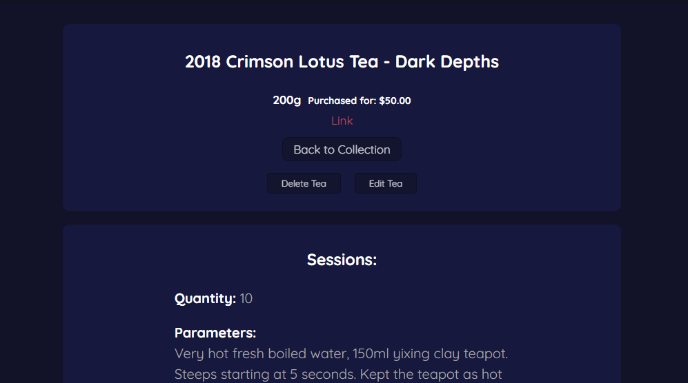

# PUERH / CAFE

## Live Link to App
https://puerh-cafe.netlify.com/dashboard

## Api Link
https://github.com/robitaille1/puerh-cafe-api

## Summary
PUERH / CAFE is an application for tracking personal inventory for puerh tea. Many puerh tea drinkers accumulate many cakes throughout the years, and sometimes they can get lost in the shuffle. PUERH / CAFE aims to assist in keeping track of teas, as well as how they taste over time.

### Add a Collection
Organize your teas into collections, to assist in organization

### Add a Tea
Add a tea to your collections

### Add a Session
As you drink your tea, add a session, to keep track of how your tea tastes at that moment.

## Tech Used
This application was made using:
React, Redux, Express, Node, PostgreSQL, HTML, CSS
